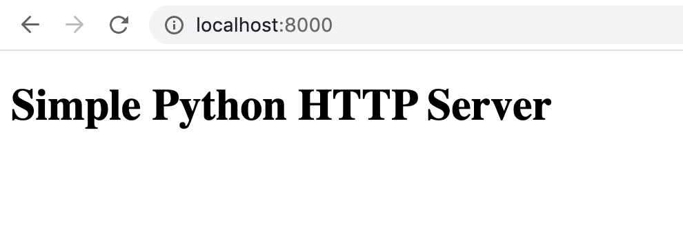
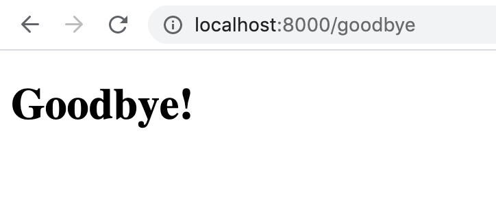

# Python Crash Course

_Exercise setting up a Python server described at https://medium.com/@andrewklatzke/creating-a-python3-webserver-from-the-ground-up-4ff8933ecb96_

##### Index Route Screenshot:
  

*********

##### Goodbye Route Screenshot:
